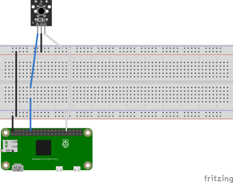

## Wake

### Description
Wake is a simple command line utility that allows you to send a WOL magic packet to a device on your network through
pressing a button hooked up to a raspberry pi GPIO pin for signal.

### To package this

You need to have fpm installed, do what you need to do to get that ruby gem installed.

run `make packages`

## Building

run `make build` to build the binary with no cross compilation for where ever you are running the build.
run `make rpi-zero` to build the binary for a raspberry pi zero.
run `make rpi-5` to build the binary for a raspberry pi 5.

## Wiring for a Keyes KY-004 Button

[Fritzing Diagram of Switch](https://arduinomodules.info/download/ky-004-key-switch-module-zip-file/)




Connect the VCC pin to a 5v pin on the raspberry pi. 3.3v is probably fine as well, but I didn't check, I'll check later.
Connect the GND pin to a GND pin on the raspberry pi.
Connect the S pin to a GPIO pin on the raspberry pi.

## Running
There's a systemd file example in the deb folder, you can use that to run the binary as a service.

If installed via deb there's a configuration file included and placed in `/etc/wake/config.yaml`, this is a copy of the 
file `wake.yaml` found in the root of the repo. You can use to configure the GPIO pin and the MAC address of the device 
you want to wake up. If you wish to use the service, set the dry_run value to false. I chose to make the config file 
default to dry run so no errant wake-ups are sent.

You can run the application directly from the command line this assumes you have wake in your path, if you installed from deb
this is probably the case, but if not make sure /usr/local/bin is in your path.

```console
admin@wolbutton:~ $ sudo wake --pin 20 --mac-address 00:11:22:33:44:55 --dry-run
time=2024-12-29T22:39:24.826-06:00 level=INFO msg="Starting wake utility" pin=20 mac_address=00:11:22:33:44:55 interface=wlan0
time=2024-12-29T22:39:27.649-06:00 level=INFO msg="Signal received" pin=20 mac_address=00:11:22:33:44:55 interface=wlan0
time=2024-12-29T22:39:27.649-06:00 level=INFO msg="Dry run mode: WOL packet not sent" pin=20 mac_address=00:11:22:33:44:55 interface=wlan0
time=2024-12-29T22:39:27.850-06:00 level=INFO msg="Signal cleared" pin=20 mac_address=00:11:22:33:44:55 interface=wlan0
```

Remove the --dry-run flag to actually send the magic packet.
```console
admin@wolbutton:~ $ sudo wake --pin 20 --mac-address 00:11:22:33:44:55
time=2024-12-29T22:40:09.258-06:00 level=INFO msg="Starting wake utility" pin=20 mac_address=00:11:22:33:44:55 interface=wlan0
time=2024-12-29T22:40:11.479-06:00 level=INFO msg="Signal received" pin=20 mac_address=00:11:22:33:44:55 interface=wlan0
time=2024-12-29T22:40:11.481-06:00 level=INFO msg="Magic packet sent" pin=20 mac_address=00:11:22:33:44:55 interface=wlan0
time=2024-12-29T22:40:11.583-06:00 level=INFO msg="Signal cleared" pin=20 mac_address=00:11:22:33:44:55 interface=wlan0
```

You can exit the command with a `ctrl-c` or by sending a SIGINT or SIGKILL to the process.


